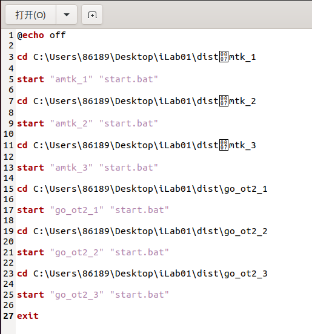
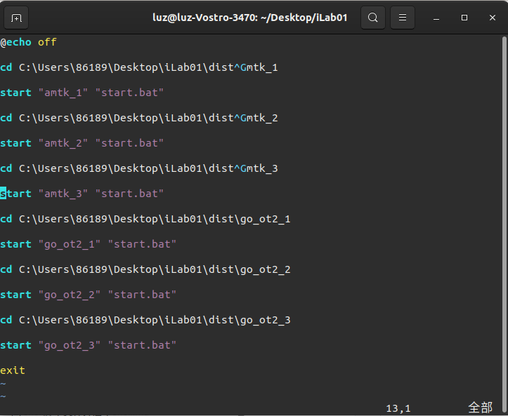
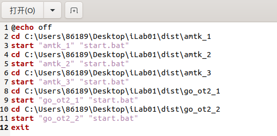
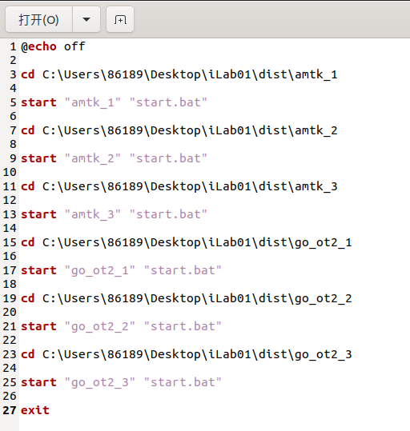

# 问题：使用echo -e打印带转义字符的字符串时出现奇怪的特殊字符

**脚本test.sh:**


```shell
workdir="C:\\Users\\86189\\Desktop\\iLab01\\dist"

echo -e "@echo off\n
cd $workdir\\amtk_1\n
start \"amtk_1\" \"start.bat\"\n
cd $workdir\\amtk_2\n
start \"amtk_2\" \"start.bat\"\n
cd $workdir\\amtk_3\n
start \"amtk_3\" \"start.bat\"\n
cd $workdir\\go_ot2_1\n
start \"go_ot2_1\" \"start.bat\"\n
cd $workdir\\go_ot2_2\n
start \"go_ot2_2\" \"start.bat\"\n
cd $workdir\\go_ot2_3\n
start \"go_ot2_3\" \"start.bat\"\n
exit" >dist/start.bat
```

运行sh脚本后，打开start.bat文件发现有特殊字符。


使用`cat`命令查看：

```bash
(base) luz@luz-Vostro-3470:~/Desktop/iLab01$ cat dist/start.bat 
@echo off

cd C:\Users\86189\Desktop\iLab01\distmtk_1

start "amtk_1" "start.bat"

cd C:\Users\86189\Desktop\iLab01\distmtk_2

start "amtk_2" "start.bat"

cd C:\Users\86189\Desktop\iLab01\distmtk_3

start "amtk_3" "start.bat"

cd C:\Users\86189\Desktop\iLab01\dist\go_ot2_1

start "go_ot2_1" "start.bat"

cd C:\Users\86189\Desktop\iLab01\dist\go_ot2_2

start "go_ot2_2" "start.bat"

cd C:\Users\86189\Desktop\iLab01\dist\go_ot2_3

start "go_ot2_3" "start.bat"

exit
```

使用`vi`查看如下图：


## 解决办法

### 1.完全文本

> 完全文本（full text）是指包含完整信息的文本，通常是指全文文本。在信息检索领域，完全文本指的是一篇完整的文档，包含标题、正文、图片等元素。在文献检索、学术搜索等领域，完全文本通常指的是全文数据库，其中包含了完整的文献信息，如标题、摘要、作者、出版物等，并提供了全文可检索的功能。


> EOF_token是一种自定义标记，用于标识文本块的结束位置。在shell脚本中，可以使用以下语法来指定EOF_token：
>
> ```bash
> command << EOF_token
> text block
> EOF_token
> ```
> 其中command表示需要执行的命令，<<表示输入重定向，EOF_token是自定义的标记名称，用于标识输入的文本块的结束位置。在EOF_token之间的所有文本块将被作为标准输入传递给command命令执行。
>
> 示例代码：
>
> ```bash
> cat << END
> This is a sample text block.
> It can contain multiple lines.
> END
> ```
> 在这个例子中，cat命令会将<< END和END之间的文本块输出到标准输出。
>

修改脚本为：

```shell
cat << EOF_token >dist/start.bat
@echo off
cd C:\Users\86189\Desktop\iLab01\dist\amtk_1
start "amtk_1" "start.bat"
cd C:\Users\86189\Desktop\iLab01\dist\amtk_2
start "amtk_2" "start.bat"
cd C:\Users\86189\Desktop\iLab01\dist\amtk_3
start "amtk_3" "start.bat"
cd C:\Users\86189\Desktop\iLab01\dist\go_ot2_1
start "go_ot2_1" "start.bat"
cd C:\Users\86189\Desktop\iLab01\dist\go_ot2_2
start "go_ot2_2" "start.bat"
exit
EOF_token
```

执行脚本后正确了。


### 2.偶然发现的，也可以不出现特殊字符了，为什么呢？

```shell
workdir="C:\\Users\\86189\\Desktop\\iLab01\\dist"

echo -e "@echo off\n
cd $workdir\\\amtk_1\n
start \"amtk_1\" \"start.bat\"\n
cd $workdir\\\amtk_2\n
start \"amtk_2\" \"start.bat\"\n
cd $workdir\\\amtk_3\n
start \"amtk_3\" \"start.bat\"\n
cd $workdir\\go_ot2_1\n
start \"go_ot2_1\" \"start.bat\"\n
cd $workdir\\go_ot2_2\n
start \"go_ot2_2\" \"start.bat\"\n
cd $workdir\\go_ot2_3\n
start \"go_ot2_3\" \"start.bat\"\n
exit" >dist/start.bat
```


